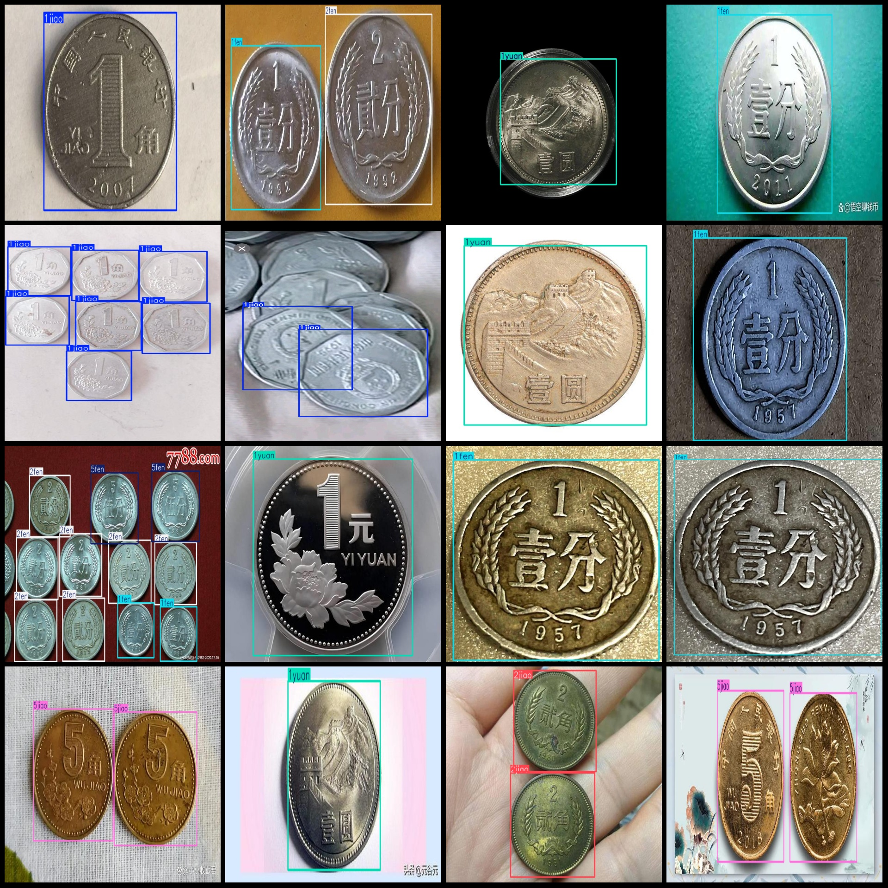
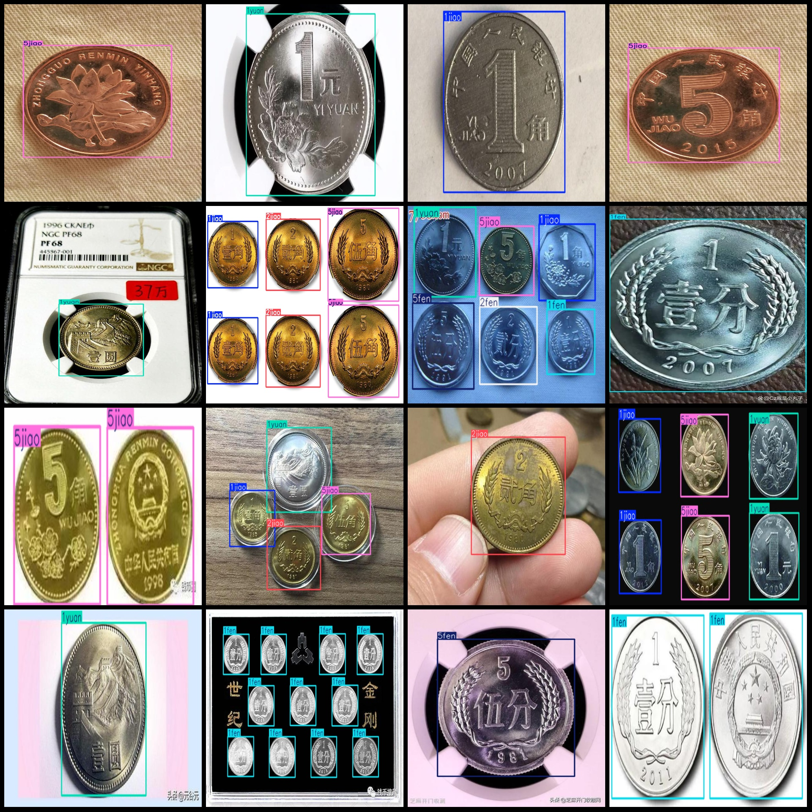

# Coin Values Detection Dataset: VOC+YOLO Format, 230 Images in 7 Categories

Dataset format: Pascal VOC format + YOLO format (without split path in the .txt file, only containing jpg images along with corresponding VOC format xml files and YOLO format txt files)
Number of images (jpg file count): 230
Number of annotations (xml file count): 230
Number of annotations (txt file count): 230
Number of categories: 7
Annotation category names (note that the order of categories in the YOLO format does not match this, but is based on the labels folder's classes.txt): ["1fen", "1jiao", "1yuan", "2fen", "2jiao", 
"5fen", "5jiao"]
Box counts per category:
1fen box count = 72
1jiao box count = 145
1yuan box count = 161
2fen box count = 84
2jiao box count = 42
5fen box count = 87
5jiao box count = 209
Total box count: 800
Number of images per category:
1fen image count = 45
1jiao image count = 73
1yuan image count = 91
2fen image count = 42
2jiao image count = 25
5fen image count = 46
5jiao image count = 83
Image resolution: Images in multiple resolutions, such as 806x366, 500x375, etc.
Annotation tool used: labelImg
Annotation rules: Draw a rectangular box around the category.
Important notice: The dataset does not have any split for training validation test sets; you need to manually divide it.
Special declaration: This dataset does not guarantee any accuracy in the trained models or weight files.
Image preview:
Annotation example:

I. Image

Here is a pay link on Stripe ( https://buy.stripe.com/3cs8yP7sY87d0vu9AB ). Please contact me lonlonago@foxmail.com after funding $89, and I will send you a complete data files , thank you!

